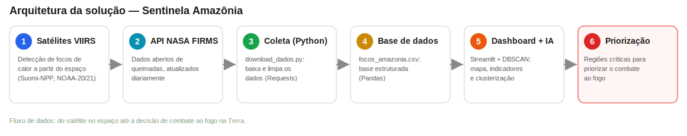

# Sentinela Amazônia
### Monitoramento Inteligente de Queimadas com Dados de Satélite

**Sub Global Solution 2026.1 — FIAP**
**Graduação ON em Inteligência Artificial**

**Nome:** Letícia Angelim Guerra
**RM:** 567501

---

## 1. Introdução

A exploração espacial deixou de ser apenas científica: hoje, os satélites de observação da Terra são uma das peças centrais da nova economia espacial. Eles monitoram o clima, apoiam o agronegócio e — o que motiva este projeto — detectam, todos os dias, **focos de calor** na superfície do planeta. Esses dados, gerados no espaço, têm um valor enorme para resolver um problema muito concreto aqui na Terra: as **queimadas na Amazônia**.

A Amazônia sofre com milhares de focos de queimada por dia durante a estação seca. O desafio não é só *saber* que há fogo — os satélites já nos dão isso —, mas **transformar milhares de pontos soltos num mapa em uma decisão**: onde agir primeiro? Que regiões concentram o fogo mais intenso?

Este projeto responde à pergunta central da Sub Global Solution 2026.1:

> *Como a Inteligência Artificial e as tecnologias digitais podem transformar a nova economia espacial e gerar impacto positivo na Terra?*

**Objetivo:** desenvolver uma prova de conceito (POC) que use dados reais de satélite e Inteligência Artificial para **identificar automaticamente as regiões mais críticas de queimada na Amazônia Legal**, apoiando a priorização do combate ao fogo.

---

## 2. Desenvolvimento

### 2.1 Visão geral da solução

A solução é um pipeline completo que vai do dado de satélite até a informação pronta para decisão:



1. **Satélites VIIRS** detectam focos de calor a partir do espaço.
2. A **API do NASA FIRMS** disponibiliza esses dados de forma aberta.
3. Um **script em Python** baixa e organiza os dados.
4. Os dados são salvos em uma **base estruturada** (CSV).
5. Um **dashboard em Streamlit** apresenta tudo e aplica **Inteligência Artificial** (clusterização) para encontrar as regiões críticas.
6. O resultado é a **priorização** das áreas para combate ao fogo.

### 2.2 Fonte de dados

Os dados vêm do **NASA FIRMS** (*Fire Information for Resource Management System*), serviço público e gratuito da NASA. Foram utilizados três satélites da família **VIIRS** (Suomi-NPP, NOAA-20 e NOAA-21), que detectam anomalias térmicas na superfície.

A variável mais importante é o **FRP (*Fire Radiative Power*)**, medido em megawatts (MW): ele representa a **potência radiativa do fogo**, ou seja, a intensidade de cada foco. É o que permite diferenciar uma pequena queimada de um grande incêndio.

A região monitorada é a **Amazônia Legal**, delimitada por uma caixa de coordenadas geográficas (latitude/longitude).

### 2.3 Coleta de dados

O script `download_dados.py` consome a API do FIRMS, combinando os três satélites para ampliar a cobertura. O trecho principal:

```python
FONTES = ["VIIRS_SNPP_NRT", "VIIRS_NOAA20_NRT", "VIIRS_NOAA21_NRT"]
AREA_AMAZONIA = "-74,-18,-44,5"   # oeste, sul, leste, norte
DIAS = 5                           # a API em tempo real permite no máximo 5 dias

def baixar_focos(map_key):
    partes = []
    for fonte in FONTES:
        url = (
            "https://firms.modaps.eosdis.nasa.gov/api/area/csv/"
            f"{map_key}/{fonte}/{AREA_AMAZONIA}/{DIAS}"
        )
        resposta = requests.get(url, timeout=60)
        resposta.raise_for_status()
        parte = pd.read_csv(StringIO(resposta.text))
        partes.append(parte)
    return pd.concat(partes, ignore_index=True)
```

### 2.4 A aplicação (dashboard)

A interface foi construída em **Streamlit**. Ela oferece:

- **Indicadores (KPIs):** total de focos, dias monitorados, FRP médio e FRP máximo.
- **Mapa interativo** dos focos, coloridos e dimensionados pela intensidade (FRP).
- **Gráfico de evolução** diária do número de focos.
- **Filtros** por período, intensidade mínima e horário (dia/noite).

*(Inserir aqui o print do dashboard — visão geral com mapa e indicadores.)*

### 2.5 Inteligência Artificial: clusterização DBSCAN

O coração analítico do projeto é o algoritmo **DBSCAN** (*Density-Based Spatial Clustering of Applications with Noise*), um método de aprendizado de máquina **não supervisionado**. Ele agrupa focos que estão geograficamente próximos e concentrados, e trata focos isolados como "ruído".

A escolha do DBSCAN faz sentido porque:

- **Não precisa de dados rotulados** — não temos um "gabarito" de quais regiões são críticas; o algoritmo descobre sozinho.
- **Não exige definir o número de grupos antecipadamente** (diferente do K-Means).
- **Separa o sinal do ruído** — focos espalhados não viram "região crítica".

Usei a distância **haversine** (distância real sobre a esfera terrestre), convertendo o raio de agrupamento de quilômetros para radianos:

```python
from sklearn.cluster import DBSCAN
import numpy as np

coords = np.radians(df[["latitude", "longitude"]].to_numpy())
modelo = DBSCAN(
    eps=raio_km / 6371.0,   # raio de vizinhança (km -> radianos)
    min_samples=min_focos,  # mínimo de focos para formar uma região
    metric="haversine",
)
df["cluster"] = modelo.fit_predict(coords)
```

Cada região identificada recebe um índice de **severidade**:

```python
severidade = numero_de_focos * frp_medio
```

Esse índice prioriza regiões que são **grandes E intensas** ao mesmo tempo, gerando o ranking das áreas mais críticas.

*(Inserir aqui o print da seção de IA — tabela das regiões críticas e o mapa colorido.)*

### 2.6 Principais decisões técnicas

- **Recorte na Amazônia Legal:** escolhi a Amazônia Legal (região oficial) em vez de só o bioma, pois é onde se concentra o "arco do desmatamento".
- **Combinação de 3 satélites:** aumenta o número de detecções e a confiabilidade do monitoramento.
- **DBSCAN em vez de K-Means:** por não exigir o número de grupos e por separar o ruído.
- **Severidade = focos × FRP:** porque priorizar só por quantidade ignoraria incêndios pequenos mas muito intensos.

---

## 3. Resultados

Com os dados reais dos últimos 5 dias de observação na Amazônia Legal, a aplicação processou **mais de 10.000 focos de calor** e identificou automaticamente as regiões críticas, ordenadas por severidade.

Um resultado importante e **não óbvio** apareceu na análise: nesta época do ano (junho, início da seca), os focos **não** se concentram no núcleo verde da floresta, mas sim no **arco do desmatamento** (sul do Pará, Mato Grosso, Rondônia, Tocantins) e na transição com o Cerrado. O pico de queimadas na floresta ocorre entre **agosto e outubro**. Isso reforça o valor de um sistema de **monitoramento contínuo ao longo do ano**, e não apenas no pico.

*(Inserir aqui o print com os indicadores e, se quiser, a tabela do Top 10 regiões críticas.)*

**Resultados esperados / impacto:**

- Reduzir o tempo entre a detecção do fogo e a decisão de combate.
- Direcionar recursos limitados (brigadas, fiscalização) para onde o impacto é maior.
- Servir de base para evoluções futuras, como previsão de risco de fogo.

---

## 4. Conclusões

O **Sentinela Amazônia** mostra, na prática, como a economia espacial gera impacto positivo na Terra: dados gerados por satélites no espaço, combinados com Inteligência Artificial, viram uma ferramenta concreta de apoio ao combate às queimadas.

A POC cumpre o que se propôs: coleta dados reais de satélite, apresenta um dashboard interativo e usa aprendizado de máquina (DBSCAN) para transformar milhares de pontos em uma lista priorizada de regiões críticas.

**Limitações:**

- A API em tempo quase real fornece no máximo 5 dias de histórico.
- "Foco de calor" não é exatamente "queimada confirmada" — o satélite detecta anomalias térmicas.

**Próximos passos:**

- Integrar dados climáticos para **prever** risco de fogo (não só monitorar).
- Adicionar séries históricas para análises sazonais.
- Publicar a aplicação na nuvem (Streamlit Cloud ou AWS) para acesso público.

---

## 5. Links

- 🎥 **Vídeo demonstrativo (YouTube, não listado):** INSERIR_LINK_AQUI
- 💻 **Repositório do projeto:** INSERIR_LINK_AQUI
